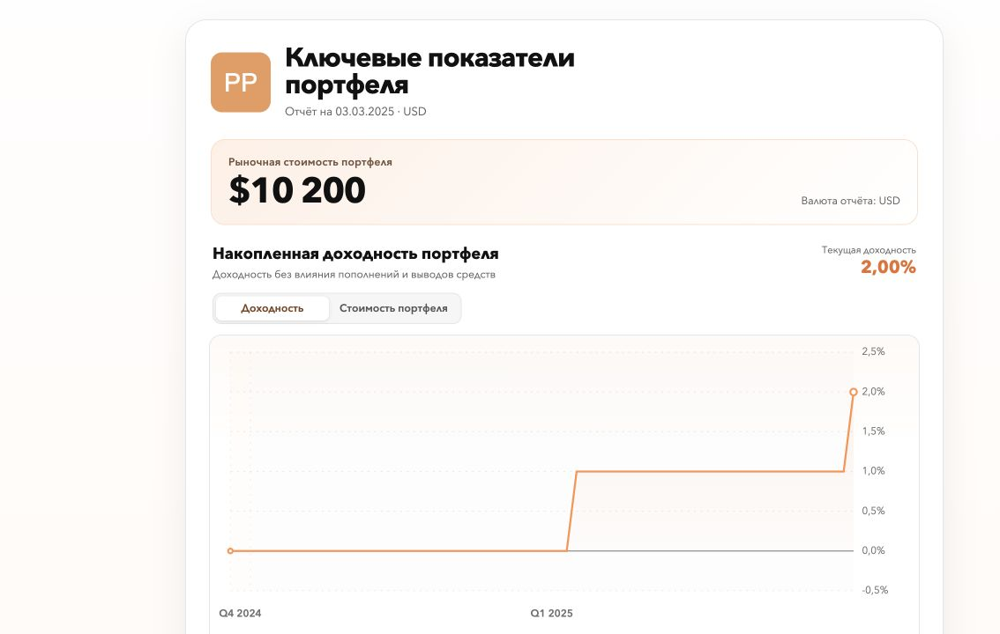

# Portfolio Performance → HTML reporting automation

A local reporting pipeline that turns Portfolio Performance XML into a standalone HTML dashboard, with official TTWROR, IRR and Profit metrics and checks on data integrity.

**Internship portfolio · Python + Java integration · Synthetic public demo**



## Problem
Portfolio information stored in XML needs to become an understandable report without manually transcribing balances, returns or cash flows. A useful report also needs a clear boundary between official calculations and presentation logic.

## Approach
`Portfolio Performance XML → pinned Java engine → report.json + daily series → Python validation and rendering → standalone HTML`

The Java adapter invokes Portfolio Performance's existing calculations. Python parses account/security references, normalizes transactions, handles valuation and currency views, and renders reports. The original one-command workflow also checks the input hash and publishes dashboard/validation output atomically.

## Stack
Python standard library, Decimal, XML, Java 21, Portfolio Performance, Maven, HTML/CSS/JavaScript, unittest. The renderer needs no Python packages; see [requirements.txt](requirements.txt).

## Key Features
- TTWROR, annualized TTWROR, money-weighted IRR and Profit from the pinned upstream engine.
- Separate calculation, validation and presentation layers.
- Fixed-point amount handling and explicit reference-resolution errors.
- XML protections for external entities, malformed input, size limits and symlinks.
- Currency-view and dated FX components; missing official inputs fail closed.
- Existing incremental CSV import adapter and watcher source retained for inspection.
- Self-contained HTML with a return/value chart toggle.

## Results
Verified on the **new synthetic cash-only fixture**, not on a client portfolio:

| Check | Result |
|---|---:|
| Opening deposit | USD 10,000 |
| Two synthetic interest payments | USD 100 + USD 100 |
| Ending portfolio value | USD 10,200 |
| Profit | USD 200 |
| Cumulative TTWROR | 2.00% |
| Annualized IRR | approximately 12.80% |
| Public parser/reference/scaling tests | 20 passed |

The fixture spans the fixed reporting period 2024-12-30 to 2025-03-03. Annualized returns depend on the engine's date conventions and are not the two-month percentage gain. No measured time savings, real investment results or client adoption claims are made.

## My Contribution
My internship project focused on automating the path from portfolio files to readable reports: integrating the official calculation engine, processing XML references and transactions, validating data, and generating a standalone HTML dashboard. The retained Python modules, Java adapters and tests demonstrate this work.

I integrated **Portfolio Performance** for TTWROR, IRR and Profit; I do not claim authorship of its financial engine. The public synthetic fixture and demo wrapper were added during portfolio preparation. See [contribution boundaries](docs/CONTRIBUTION.md).

## How to Run
Python 3.12 or 3.13. Run commands from this repository's root.

### Quick demo — no Java, credentials or network
```bash
python3 scripts/demo.py
```
Open `output/DEMO-dashboard.html`. This renders the included engine-generated **synthetic** report; it does not recalculate the XML.

### Recalculate from the synthetic XML
```bash
python3 scripts/demo.py --recalculate
```
This calls the retained cross-platform launcher and official engine. First run may download Java 21, Maven and pinned upstream sources/build dependencies. It needs internet access and may take several minutes. Existing compatible installations can be selected with `PP_JAVA_HOME` and `PP_MAVEN_HOME`.

### Tests
```bash
python3 -m unittest discover -s tests -v
```

### Original full workflow
`bin/build-portfolio-dashboard` is retained for code review. It expects one compatible XML under `input/`, dashboard period definitions and dated FX inputs. The public quick demo exercises the official exporter and renderer, **not the entire USD/EUR, grouped-client, Windows-delivery workflow**. See [limitations](docs/LIMITATIONS.md).

## Screenshots / Demo
- [Open/download the standalone synthetic HTML](examples/DEMO-dashboard.html) — GitHub displays its source; download and open locally.
- [Screenshot](docs/demo.png).
- [Synthetic XML](examples/DEMO-portfolio.xml), [CSV](examples/DEMO-transactions.csv), [official report](examples/DEMO-report.json), [daily series](examples/DEMO-performance_series.csv).
- Demo files were created specifically for this public portfolio in September 2026; they are not internship client outputs.

## Repository structure
```text
renderer/          Original Python parsing, valuation and rendering
upstream-overlay/  Original Java integration adapters
bin/               Selected original launchers and pipeline
scripts/demo.py    New public-demo wrapper (clearly separated)
automation/        Original import automation source
examples/          Entirely synthetic data and generated report
tests/             Existing self-contained test cases
docs/              Evidence, limitations and screenshot
licenses/          Upstream notices and EPL text
```

## Attribution
Portfolio Performance is an external open-source project; its engine is pinned to commit `2f3917512f4d042cc4dd2abcf24ae62d665f9b18`. See [third-party notice](licenses/Portfolio-Performance-NOTICE.txt). This package contains adapter source, not the engine binary. No blanket license for the internship project's original Python code is asserted.
